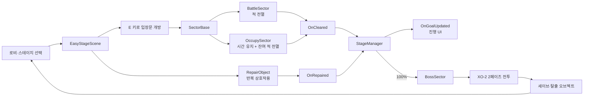

# SpedEx

> 구역별 목표를 달성하고 2페이즈 보스 `XO-2`를 격파해 배송을 완수하는 3D PvE TPS


**41일 · 2인 개발 · 팀장/PM · 1개 스테이지와 보스전 완성**

[▶ 플레이 영상](https://youtu.be/rcD1s-mBI10) · [전체 포트폴리오](https://hwang-doyeon-game-dev.hwangdy135.chatgpt.site/) · [상세 개발 기록](https://app.notion.com/p/99cf1fce5d1683c5a6f3017a7d2b64c4)

[](https://youtu.be/rcD1s-mBI10)

## 프로젝트 개요

| 항목 | 내용 |
| --- | --- |
| 개발 기간 | 2026.05.14–2026.06.23 · 41일 |
| 팀 구성 | 2인 팀 |
| 개인 역할 | 팀장, PM, 게임·스테이지 기획, 클라이언트 개발 |
| 개인 담당 | 섹터·목표 달성도, 적 AI, 감시 포탑, 보스 `XO-2`, 오브젝트 풀링, 상호작용·씬 전환·데이터/세이브 연결 |
| 장르 / 플랫폼 | 3D TPS · PvE 루트슈터 / Windows PC |
| 개발 환경 | Unity 6000.3.9f1 · C# · URP 17.3.0 |
| 주요 패키지 | Unity Behavior 1.0.15 · AI Navigation 2.0.10 · Cinemachine 3.1.6 · Input System 1.18.0 |
| 완성 범위 | `MainScene → LobyScene → EasyStageScene`으로 이어지는 1개 스테이지와 보스전 MVP |
| 배포 상태 | 개발 종료 · 출시 예정 없음 · Windows 빌드 산출 기록은 있으나 실행 파일은 저장소에 미포함 |

플레이어는 범우주 배송 회사 **SpedEx**의 배달부입니다. 목적지로 향하는 항로를 점거한 해적단과 경비 로봇을 제거하고 화물을 지켜야 합니다. 전투의 목적을 단순 처치가 아니라 **배송 경로 복구와 배달 완수**로 정의하고, 여러 구역의 목표 달성도를 보스 진입 조건과 연결했습니다.

### 핵심 플레이 흐름

**로비 탐색 → 스테이지 선택 → 전투·점령·수리 구역 공략 → 목표 달성도 100% → 보스전 → 무기 해금 → 로비 복귀**

| 구역 | 완료 조건 | 플레이 의도 |
| --- | --- | --- |
| 전투 구역 | 배치된 적 전멸 | 진입 전 정찰과 원거리 선제 공격 허용 |
| 점령 구역 | 제한 시간 유지 후 잔여 적 전멸 | 계속 생성되는 적을 상대하며 위치를 지키는 전투 |
| 수리 구역 | 오브젝트 반복 상호작용으로 100% 수리 | 사격 이외의 목표로 전투 리듬 조절 |
| 보스 구역 | 전체 목표 100% 달성 후 `XO-2` 처치 | 탐색 결과를 최종 전투의 진입 조건으로 연결 |

## 플레이 화면

| 무기 선택 | 에너지 공격 회피 |
| --- | --- |
|  |  |

| 일반 전투 | 보스 위험 지대 |
| --- | --- |
|  |  |

## 담당 역할과 팀 작업의 경계

### 개인 담당

- 팀장·PM으로 주차별 목표와 기능 범위를 관리하고 개인 브랜치 → `dev` 검증 → `main` 반영 흐름 운영
- 전투·점령·수리·보스 구역을 공통 목표 시스템으로 연결
- Behavior Graph와 NavMesh 기반 적 감지·추적·공격·조사 흐름 및 디버그 시각화 구성
- 감시 포탑의 조준·발사 판정과 발사체 풀링 구현
- `XO-2`의 거리별 공격, 9×9 바닥 패턴, 2페이즈 전환과 컷씬 구성
- ScriptableObject 데이터, 세이브, BGM, 상호작용과 씬 전환을 플레이 사이클에 통합

### 팀원 담당

- 무기 시스템, 사격·재장전·반동과 플레이어 컨트롤러
- 조준과 Animation Rigging, 무기 선택 휠
- 크로스헤어, 사운드, 이펙트와 수류탄

위 구분은 저장소 전체를 단독 구현했다는 뜻이 아닙니다. `main`에 도달하는 커밋은 두 작성자에게 각각 **109개와 110개**이며, 수치는 작업량이나 기여도를 환산하는 용도가 아니라 협업 이력을 설명하기 위한 참고값입니다.

## 스테이지 구조

스테이지 전체를 하나의 거대한 스크립트로 제어하지 않고 **구역을 진행의 최소 단위**로 정의했습니다. 구역별 완료 조건은 각 구현체가 판단하고, `StageManager`는 완료 이벤트를 모아 전체 달성도와 UI만 갱신합니다.



- [`SectorBase.cs`](Assets/02.Script/Sector/SectorBase.cs): 진입 트리거, 전투 시작, 클리어, 문 제어와 `OnCleared` 발행
- [`BattleSector.cs`](Assets/02.Script/Sector/BattleSector.cs): 데이터에 배치된 적을 활성화하고 전멸 여부 판단
- [`OccupySector.cs`](Assets/02.Script/Sector/OccupySector.cs): 점령 중 재소환, 제한 시간 종료 후 잔여 적 전멸 단계 처리
- [`RepairObject.cs`](Assets/02.Script/Stage/RepairObject.cs): 쿨다운이 있는 반복 상호작용과 `OnRepaired` 발행
- [`StageManager.cs`](Assets/02.Script/Manager/StageManager.cs): 목표 이벤트 구독, 달성도 계산과 UI 이벤트 전달

입장문은 자동으로 열지 않고 플레이어가 `E` 키로 직접 열도록 했습니다. 문을 여는 행동을 “이 구역에 진입하겠다”는 명시적 선택으로 사용해 준비 없이 전투 트리거에 들어가는 상황을 줄였습니다.

## 대표 문제 해결: 풀링된 적의 이전 상태가 남는 문제

점령 구역의 반복 소환 과정에서 비활성화했던 적을 그대로 재사용하면, 생성·파괴 비용은 줄어도 **이전 생명주기의 이동·물리·회전 상태**가 다음 소환으로 이어졌습니다.

| 단계 | 내용 |
| --- | --- |
| 현상 | 재소환 직후 이전 목적지로 이동하거나, 미끄러지며 밀리고, 콜라이더가 기울어진 상태로 활성화됨 |
| 원인 | `NavMeshAgent` 경로, 자식 `Rigidbody` 속도, Root Motion으로 누적된 스켈레톤 루트 회전이 남아 있었음 |
| 반환 처리 | `isStopped`와 `ResetPath()` 적용, 자식 Rigidbody의 선속도·각속도 초기화 후 비활성화 |
| 재활성화 처리 | 비활성 상태에서 위치·회전·스케일과 스켈레톤 회전을 먼저 확정한 뒤 활성화·데이터 주입·Agent 재설정 |
| 선택 이유 | `OnEnable`과 물리/NavMesh 초기화가 새 소환 지점을 기준으로 동작하도록 순서를 고정하기 위해서 |

해결 코드는 [`EnemyPoolManager.cs`](Assets/02.Script/Manager/EnemyPoolManager.cs)에 있으며, 해당 변경이 들어간 [커밋 `9d32581`](https://github.com/doyeon-SM/OZ05_3DTPS/commit/9d325819616ec176343aa8bf7a36400a101b261f)에서 이전 구현과의 차이를 확인할 수 있습니다. 저장소에는 이 시나리오를 자동 재현하는 회귀 테스트가 없으므로, 코드와 커밋으로 수정 내용은 검증했지만 자동화된 성능·회귀 수치를 주장하지 않습니다.

## 적 AI와 감시 포탑

Unity Behavior와 NavMesh를 이용해 **순찰 → 감지 → 추격 → 공격 → 마지막 목격 위치 조사 → 순찰 복귀** 흐름을 구성했습니다.

- 거리·시야각·장애물 레이어를 조합한 가시성 판정
- 시야를 잃으면 마지막 목격 위치로 이동하고 도착 또는 타임아웃 뒤 순찰 복귀
- 공격 범위에서 NavMeshAgent 자동 회전을 끄고 스크립트가 직접 회전
- 정면 15도 이내로 정렬된 뒤 공격 트리거 실행
- Behavior Graph 상태가 기대와 다를 때 NavMeshAgent를 직접 구동하는 폴백
- 콘솔 모니터와 Gizmo로 거리, 시야, 장애물, 선택 분기를 확인할 수 있는 디버그 도구

적이 몸을 다 돌리기 전에 공격하던 문제는 공격 범위 안에서 `NavMeshAgent.updateRotation`을 끄고 설정 데이터의 회전 속도로 직접 정렬하도록 수정했습니다. 감시 포탑은 모델의 머즐 축이 뒤틀려 있을 때도 판정이 안정적이도록 `MuzzlePoint.forward` 대신 실제 수평 회전축인 `YawPivot.forward`를 조준·발사 기준으로 사용합니다.

[`SenseTargetAction.cs`](Assets/02.Script/BehaviorTree/SenseTargetAction.cs) · [`EnemyAIDebugVisualizer.cs`](Assets/02.Script/Enemy/EnemyAIDebugVisualizer.cs) · [`BaseTurretController.cs`](Assets/02.Script/Turret/BaseTurretController.cs)

## 보스 `XO-2`

고정형 보스이지만 플레이어의 거리와 위치에 따라 다른 판단을 요구하도록 공격을 구성했습니다.

| 패턴 | 조건 / 구조 | 플레이어 대응 |
| --- | --- | --- |
| 전·후방 부채꼴 | 근거리에서 전방 또는 후방을 무작위 선택 | 예고 영역을 보고 측면 이동 |
| 레이저 | 근접 반경 밖의 원거리 공격 | 추적 예고 후 즉시 회피 |
| 9×9 바닥 패턴 | `#`자, 파도, 중앙 안전 구역 패턴 | 행·열 단위 예고를 판독 |
| 2페이즈 전환 | HP 50% 이하 최초 1회 | 무적 → 중앙 강제 이동 → 제한 벽 → 9개 줄 공격 대응 |

2페이즈에서는 예고 시간, 회전 속도, 애니메이션 속도와 머티리얼 색상을 함께 바꿉니다. 사망 처리 타이밍은 코드의 고정 대기 대신 **Animation Event**로 통일했고, 컷씬 카메라는 보스 프리팹 밖 씬에 배치한 뒤 런타임에 `LookAt`을 연결합니다. 게임플레이 카메라보다 높은 Cinemachine Priority를 사용해 기존 카메라 전환과 분리했습니다.

[`BossController.cs`](Assets/02.Script/Enemy/BossController.cs) · [`BossFloorPatternController.cs`](Assets/02.Script/Enemy/BossFloorPatternController.cs) · [`BossCinematicController.cs`](Assets/02.Script/Enemy/BossCinematicController.cs) · [`BossAnimationEventRelay.cs`](Assets/02.Script/Enemy/BossAnimationEventRelay.cs)

## 데이터와 저장

- 적, AI 설정, 구역 배치, 보스, 드랍 테이블, 스테이지와 무기 수치를 ScriptableObject로 분리
- `JsonUtility`가 `Dictionary`를 직렬화하지 못하는 제약을 고려해 스테이지·무기·탄약을 ID 기반 Entry List로 저장
- `RuntimeInitializeOnLoadMethod`로 `SaveManager`를 씬 로드 전에 생성해 개별 씬 테스트에서도 저장 시스템을 사용할 수 있게 구성
- “저장 기록 없음”과 “탄약 0발”을 구분하기 위해 미저장 탄약 조회 시 `-1` 반환
- AudioSource 두 개를 번갈아 사용하는 BGM 크로스페이드와 보스 진입·종료 연결

[`SaveManager.cs`](Assets/02.Script/Manager/SaveManager.cs) · [`BGMManager.cs`](Assets/02.Script/Manager/BGMManager.cs) · [`EnemyData.cs`](Assets/02.Script/ScriptableObject/EnemySO/EnemyData.cs) · [`WeaponData.cs`](Assets/02.Script/ScriptableObject/WeaponSO/Script/WeaponData.cs)

## AI 활용과 검증 범위

개발 과정에서 **Claude Code와 Unity MCP**를 구현·검토 보조, 에디터 상태와 프로젝트 구조 확인에 사용했습니다. Git 커밋 작성자 정보는 변경을 저장소에 반영한 계정만 보여주며, 코드가 직접 타이핑되었는지 AI 초안에서 시작했는지는 판별하지 못합니다. 따라서 이 문서는 “모든 코드를 직접 작성했다”는 주장 대신, 제가 맡은 **기획·구조 결정·AI 결과 검토·Unity 연결·플레이 흐름 통합과 수정 범위**를 중심으로 설명합니다.

## 저장소에서 확인한 결과

- `main` 기준 커밋 219개, 작성자 2명, 원격 브랜치 5개(`Hwang`, `Choi`, `dev`, `itemdrop`, `main`)
- 최초 커밋 2026.05.14, `main`의 마지막 커밋 2026.06.23
- 활성 빌드 씬 3개: `MainScene`, `LobyScene`, `EasyStageScene`
- 무기 ScriptableObject 5종: AR, MG, Pistol, SG, SMG
- 전투·점령·수리·보스의 4가지 목표 유형과 2페이즈 보스 1종

## 소스 실행

완성 실행 파일은 저장소에 포함되어 있지 않습니다. `.gitignore`에서 `/Build`와 `/Builds`를 제외하므로, 결과를 빠르게 확인하려면 [플레이 영상](https://youtu.be/rcD1s-mBI10)을 이용하거나 아래 순서로 Unity 프로젝트를 실행하세요.

```bash
git clone https://github.com/doyeon-SM/OZ05_3DTPS.git
```

1. Unity Hub에서 복제한 폴더를 프로젝트로 추가합니다.
2. [`ProjectVersion.txt`](ProjectSettings/ProjectVersion.txt)에 기록된 **Unity 6000.3.9f1**로 엽니다.
3. Package Manager의 의존성 복원이 끝날 때까지 기다립니다. Git 기반 Unity MCP 패키지가 있어 최초 복원에는 네트워크 연결이 필요합니다.
4. [`MainScene.unity`](Assets/01.Scenes/MainScene.unity)을 열어 Play합니다.

[`EditorBuildSettings.asset`](ProjectSettings/EditorBuildSettings.asset)에는 `MainScene → LobyScene → EasyStageScene` 순서로 세 씬이 활성화되어 있습니다. 현재 README 작성 과정에서는 Unity Editor 실행과 Windows 빌드 재현까지 수행하지 않았으므로, 실행 절차는 저장소의 Unity 버전·패키지·빌드 씬 설정을 기준으로 검증했습니다.

## 한계와 다음 개선

- 실제 플레이 씬은 `EasyStageScene` 한 개이며, 두 번째 스테이지 데이터와 UI는 완성된 플레이 흐름으로 이어지지 않았습니다.
- 수류탄 전환 취소와 일부 이동 애니메이션 보정이 빌드 시점의 잔여 과제로 기록되어 있습니다.
- Unity Test Framework 패키지는 포함되어 있지만, 현재 저장소에서 프로젝트 전용 EditMode/PlayMode 자동화 테스트는 확인하지 못했습니다.
- 커밋 메시지 대부분이 날짜 중심이라 변경 이유를 이력만으로 추적하기 어렵습니다. 다음 프로젝트에서는 기능 태그와 변경 이유를 커밋 규칙에 포함할 계획입니다.
- 다음 개발에서는 콘텐츠 수를 먼저 늘리기보다 AI 상태 전이와 보스 패턴을 자동 검증할 테스트를 추가하고, 한 스테이지의 전투 피드백을 더 정밀하게 다듬겠습니다.

---

상세한 기획 의도, 개발 타임라인과 회고는 [SpedEx 포트폴리오 문서](https://app.notion.com/p/99cf1fce5d1683c5a6f3017a7d2b64c4)에서 확인할 수 있습니다.
